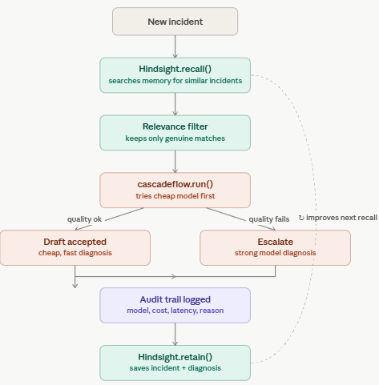
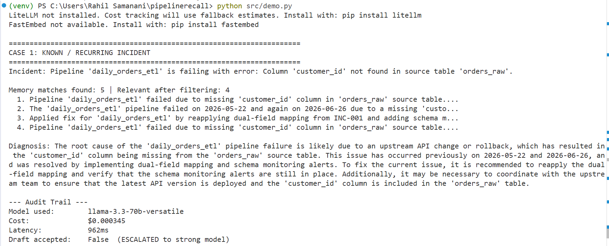
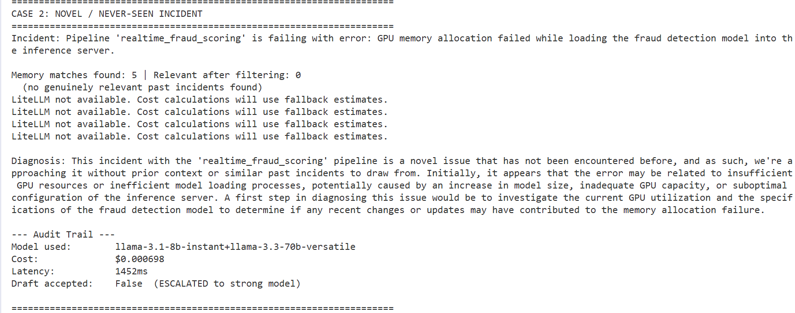
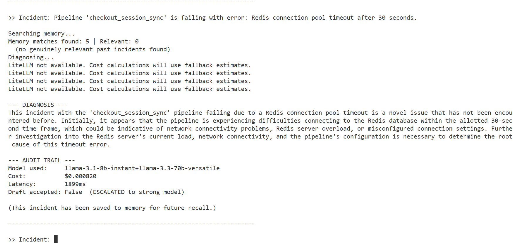
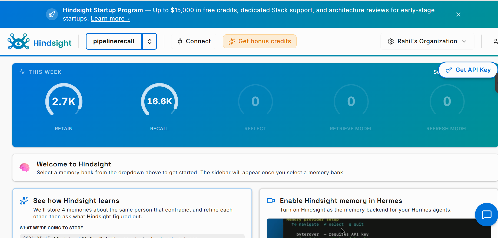
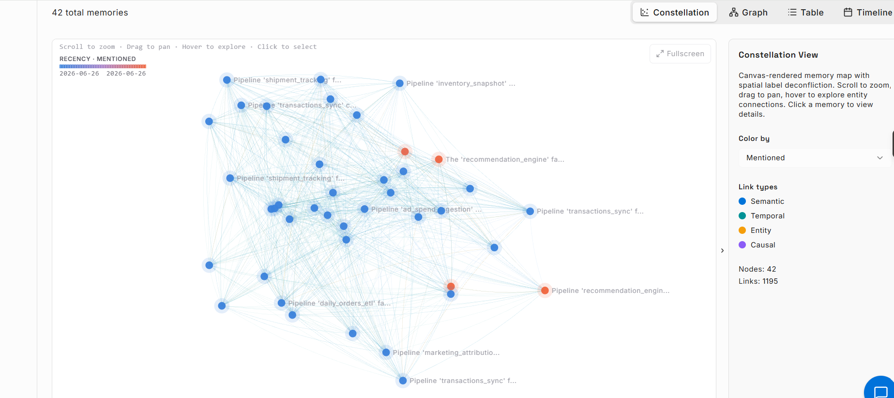

# PipelineRecall

**An AI agent that remembers why your data pipelines break — and runs smarter every time it diagnoses one.**

Built with [Hindsight](https://hindsight.vectorize.io/) (persistent agent memory) and [cascadeflow](https://docs.cascadeflow.ai/) (cost-aware runtime intelligence).

---

## Table of Contents
- [The Problem](#the-problem)
- [What PipelineRecall Does](#what-pipelinerecall-does)
- [Architecture](#architecture)
- [Demo: Known vs Novel Incident](#demo-known-vs-novel-incident)
- [Demo: Live Learning](#demo-live-learning)
- [Memory in Action](#memory-in-action)
- [Tech Stack](#tech-stack)
- [Project Structure](#project-structure)
- [Setup](#setup)
- [Synthetic Data Note](#synthetic-data-note)
- [Real-World Impact](#real-world-impact)
- [Future Improvements](#future-improvements)

---

## The Problem

When a data pipeline breaks, engineers often re-diagnose the same recurring failure from scratch — digging through logs, Slack history, or asking a senior engineer "haven't we seen this before?" That institutional knowledge usually lives in people's heads, not in any tool.

On top of that, most AI-assisted triage tools send every query to the same model regardless of complexity — burning money on simple, routine issues that don't need a powerful (and expensive) model to diagnose.

PipelineRecall solves both problems at once: it remembers, and it spends money wisely.

## What PipelineRecall Does

1. **Retains** every incident it triages — error, root cause, and fix — as a persistent memory in Hindsight.
2. **Recalls** similar past incidents the moment a new failure comes in, instead of starting from zero.
3. **Routes** the diagnosis through cascadeflow: known/simple issues are usually handled by a fast, cheap model; novel or ambiguous ones are escalated to a stronger model — automatically, based on response quality, not a hardcoded rule.
4. **Reflects**, generalizing fixes across pipelines — a deduplication fix discovered for one table gets reused when the same pattern shows up in a different table weeks later.
5. **Logs a full audit trail** of every decision: which model was used, why, the cost, and the latency.

## Architecture



A new incident is checked against Hindsight memory, filtered for genuine relevance, routed through cascadeflow (cheap model first, escalate only if needed), logged with a full audit trail, then saved back into memory — so the next similar incident benefits from this one.

## Demo: Known vs Novel Incident

Run `python src/demo.py` to see this comparison live.

**Case 1 — a known, recurring incident:** memory finds multiple relevant past occurrences, and the diagnosis cites them directly.



**Case 2 — a novel incident the agent has never seen:** memory correctly finds zero matches. Instead of guessing, the agent explicitly states this is a novel issue and gives a first-pass diagnosis.



## Demo: Live Learning

The agent doesn't only rely on pre-loaded data — it learns **during the session itself**. Try this in `python src/cli.py`:

1. Describe a brand-new incident → memory finds 0 matches → agent flags it as novel and escalates.
2. Describe the same incident again, seconds later → memory now finds genuine matches, because the agent just saved its own diagnosis.



Note: cascadeflow's escalation decision is based on response *quality*, not just whether memory exists — so even a recalled incident can still escalate if the diagnosis needs more reasoning. This is intentional: routing reflects real confidence, not a shortcut.

## Memory in Action

Hindsight's dashboard shows the agent's memory bank growing as it triages incidents — both the pre-loaded synthetic history and anything learned live during a session.



The constellation view visualizes how incidents cluster by similarity — incidents about the same pipeline (e.g. `transactions_sync`, `recommendation_engine`) group together, showing the semantic structure of the agent's memory.



## Tech Stack

| Component | Role |
|---|---|
| **Hindsight** | Persistent agent memory — retain / recall / reflect, via Hindsight Cloud |
| **cascadeflow** | Runtime intelligence — model routing, cost tracking, full audit trail |
| **Groq** | Fast, free-tier LLM inference (`llama-3.1-8b-instant`, `llama-3.3-70b-versatile`) |
| **Python** | `hindsight-client`, `cascadeflow`, `python-dotenv` |

## Project Structure

```
pipelinerecall/
├── data/
│   └── incidents.json        # 30 synthetic pipeline incidents (failures + successes)
├── src/
│   ├── load_incidents.py     # Loads synthetic incidents into Hindsight memory
│   ├── test_recall.py        # Simple script to test memory recall
│   ├── triage_agent.py       # Core agent: recall + cascadeflow routing + diagnosis
│   ├── demo.py                # Known vs novel incident comparison demo
│   └── cli.py                 # Interactive CLI — type any incident, get live triage
├── screenshots/                # Demo screenshots used in this README
├── .env.example                # Template for required API keys
└── README.md
```

## Setup

1. **Install dependencies:**
   ```
   pip install hindsight-client "cascadeflow[groq]" python-dotenv
   ```

2. **Set up your `.env` file:**
   ```
   HINDSIGHT_BASE_URL=https://api.hindsight.vectorize.io
   HINDSIGHT_API_KEY=your_hindsight_api_key
   HINDSIGHT_BANK_ID=pipelinerecall
   GROQ_API_KEY=your_groq_api_key
   ```
   - Get a Hindsight Cloud key at [ui.hindsight.vectorize.io](https://ui.hindsight.vectorize.io)
   - Get a free Groq key at [console.groq.com](https://console.groq.com)

3. **Load the synthetic incident history into memory:**
   ```
   python src/load_incidents.py
   ```

4. **Run the comparison demo:**
   ```
   python src/demo.py
   ```

5. **Or try it interactively:**
   ```
   python src/cli.py
   ```

## Synthetic Data Note

`data/incidents.json` contains 30 realistic but fully synthetic pipeline incidents, generated to simulate a data team's incident history. No real company data is used. Several incidents are deliberately recurring (e.g. the same schema-drift issue appearing 3 times across different dates) to demonstrate memory recall and pattern reflection clearly, alongside successful runs to show the agent isn't only failure-aware.

## Real-World Impact

Every company running data pipelines deals with this problem: recurring failures, tribal knowledge that disappears when an engineer leaves or goes on leave, and AI tooling that doesn't get cheaper or smarter the longer it's used. A data team running hundreds of pipeline alerts a week could realistically cut both diagnosis time and LLM spend by adopting an agent like this — exactly the kind of workflow a team would pay $50+/month to have running quietly in the background.

## Future Improvements

- Real-time integration with orchestration tools (Airflow, Dagster) to auto-ingest live pipeline failures instead of manual input
- Slack/PagerDuty integration so triage happens where engineers already work
- A confidence score surfaced alongside each diagnosis
- Multi-tenant memory banks so different teams' incident histories stay isolated
- Fine-grained budget enforcement per team/pipeline, not just per call

---

Built using Hindsight Cloud and Groq's free tier.
